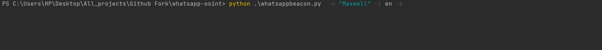

# 🕵️‍♂️ WhatsApp OSINT Tool

## 🌟 Example


Welcome to the first WhatsApp OSINT tool. This was developed in early 2019 but I decided to restart the project now for fun. 

---

# 🌍 English

## 🛠️ How to Install

First, install requirements:

```bash
pip install -r requirements.txt
```

- ✅ You will need **chromedriver**, or you can modify the code and use GeckoDriver or any other drivers for Selenium.
- ✅ You will need a **GUI** to execute the code since it interacts with web.whatsapp.com to get statuses.
- ✅ Replace the name in the file with whichever name you want to track.

---

## 🚀 How to Run

The language you choose depends on the **language** in which you have your WhatsApp Web. Some of the languages already integrated are the following:

| 🌐 Language | Code |
|-------------|------|
| 🇬🇧 English  | en   |
| 🇩🇪 German   | de   |
| 🇧🇷 Portuguese   | pt   |
| 🇪🇸 Spanish  | es   |
| 🇫🇷 French   | fr   |
| 🇮🇹 Italian  | it   |
|  Catalán | cat   |
| 🇹🇷 Turkish  | tr   |

In the user section, you must put the user you want to monitor through the program. The execution as such would be as follows:

```bash
python3 whatsappbeacon.py --username <username_to_track> --language "<language_code>"
```

---

## 📊 Export Data to Excel

To obtain the data generated by means of Excel, you can execute the following command with the **flag** `-e`:

```bash
python3 whatsappbeacon.py --username <username_to_track> --language "<language_code>" -e
```

#### Example


Where `language_code` is either `en`, `tr`, or `es` for English, Turkish, and Spanish languages. Future language support will be added.

---

## 🙌 Credits

This tool was developed by myself in my free time. It's a tool that demonstrates the power of Selenium and web scraping. I don't endorse using this tool for stalking people or any other fraudulent purposes.

Special thanks to:
- [jasperan](https://github.com/jasperan)

---

# 🇪🇸 Español

Bienvenido a la primera herramienta OSINT de WhatsApp. Esto se desarrolló a principios de 2019, pero decidí retomar el proyecto ahora por diversión.

---

## 🛠️ Como instalar

```bash
pip install -r requirements.txt
```

- ✅ Necesitas **chromedriver**, o puedes modificar el código y usar GeckoDriver o cualquier otro controlador para Selenium.
- ✅ Necesitarás una **GUI** para ejecutar el código, ya que interactúa con web.whatsapp.com para obtener estados.
- ✅ Reemplaza el nombre en el archivo con el nombre que desees rastrear.

---

## 🚀 Como ejecutar

El lenguaje que escoja depende del **idioma** en el que usted tenga su WhatsApp Web. Algunos de los idiomas ya integrados son los siguientes:

| 🌐 Idioma  | Abreviatura |
|------------|-------------|
| 🇪🇸 Español | es          |
| 🇬🇧 Inglés  | en          |
| 🇫🇷 Francés | fr          |
| 🇹🇷 Turco   | tr          |

En el apartado de usuario deberá poner el usuario que desea hacer el seguimiento por medio del programa, así que la ejecución como tal quedaría de la siguiente manera:

```bash
python3 whatsappbeacon.py --username <yulisa> --language "<lenguaje_abreviatura>"es
```

---

## 📊 Obtener datos de Excel

Para obtener los datos generados por medio de Excel, puede ejecutar el siguiente comando con la **flag** `-e`:

```bash
python3 whatsappbeacon.py --username <522711422203> --language "<lenguaje_abreviatura>" -e
```

---

## 🎥 TikTok Tutorial (Spanish)

https://user-images.githubusercontent.com/20752424/222984331-4928e06d-7da1-4521-8f2a-37cbb2a4f0cc.mp4

Video credits go to [linkfydev](https://www.instagram.com/linkfydev/) (thanks for the awesome explanation).

---

## 🙌 Créditos

Esta herramienta fue desarrollada por mí mismo en mi tiempo libre. Es una herramienta que demuestra el poder de Selenium y web scraping. No apruebo el uso de esta herramienta para acechar a las personas o para cualquier propósito fraudulento.

---

## 🌐 Traducción

La traducción al español fue generada por [daliondev](https://github.com/daliondev).

---

# 🇹🇷 Türkçe 

İlk WhatsApp OSINT (Casusluk) aracına hoş geldiniz. Bu araç 2019 senesinde geliştirilmeye başlandı ancak şimdi zevkine tekrardan geliştirmeye karar verdim. 

---

## 🛠️ Nasıl İndirebilirim

İlk olarak repoyu indirmemiz gerekiyor ve terminale bu satırı yapıştırıyoruz:

```bash
git clone https://github.com/jasperan/whatsapp-osint.git
```

Sonra `requirements.txt` dosyasını indirmemiz gerekiyor. Terminale aşağıdaki kod satırını yapıştırınız:

```bash
pip install -r requirements.txt
```

- ✅ Chrome Driver'a ihtiyacımız olacaktır. Repoda Chrome Driver mevcuttur. Eğer repo güncel değilse kendiniz indiriniz.
- ✅ WhatsApp OSINT aracı şuanlık sadece Google Chrome desteklemektedir. Chrome yüklü değilse hata alırsınız. Kendi driverinizi oluşturarak "Brave, Edge, Safari" vb. çalıştırabilirsiniz.
- ✅ Google açıldıktan sonra WhatsApp Web'e tek seferlik giriş yapmanız gerekmektedir. QR kodu okutarak giriş yapınız.
- ✅ Dosyadaki adı, izlemek istediğiniz adla değiştirin.

---

## 🚀 Programı Nasıl Çalıştırırım

Seçtiğiniz dil, WhatsApp Web'inizin bulunduğu **dile** bağlıdır. Halihazırda entegre edilmiş bazı diller şunlardır:

| 🌐 Dil      | Kod  |
|-------------|------|
| 🇪🇸 İspanyol | es   |
| 🇬🇧 İngilizce | en   |
| 🇫🇷 Fransızca | fr   |
| 🇹🇷 Türkçe   | tr   |

Kullanıcı bölümünde, program aracılığıyla izlemek istediğiniz kullanıcıyı girmelisiniz. Yürütme aşağıdaki gibi olacaktır:

```bash
python3 whatsappbeacon.py --username <Bu kısma rehberinizdeki kullanıcı adını yazınız> --language "tr"
```

---

## 📊 Excel'den Veri Almak

Excel aracılığıyla oluşturulan verileri elde etmek için **flag** `-e` ile aşağıdaki komutu çalıştırabilirsiniz:

```bash
python3 whatsappbeacon.py --username <Bu kısma rehberinizdeki kullanıcı adını yazınız> --language "tr" -e
```

---

## 🙌 Katkıda Bulunanlar

Bu araç benim tarafımdan boş zaman aktivitesi olarak geliştirildi. Aracın insanları "stalklamanız" ve "dolandırmanız" için kullanmamanızı rica ediyorum çünkü ben bu aracı yalnızca **Selenium** ve **web scraping** gücünü göstermek amacıyla geliştirdim.

---

## 🌐 Tercüme

Türkçe çeviri [BerkeGokturk71](https://github.com/BerkeGokturk71) tarafından yapılmıştır.
